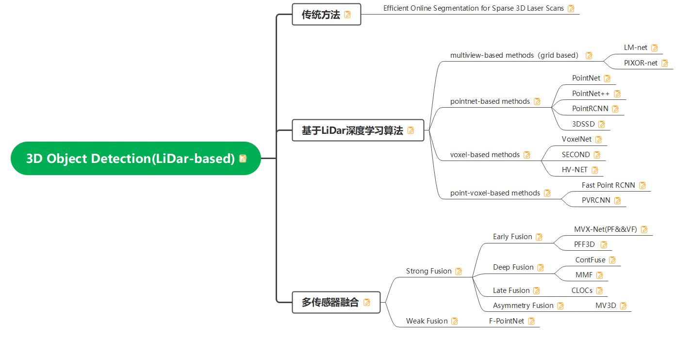

# knowledge_framework

主要是整理自己的知识框架，保存为MindMaster脑图格式，将持续更新。

MindMaster网站： https://cc-download.edrawsoft.cn/mindmaster_cn_full5587.exe

1. Lidar Detection技术。（已更新）

   

2. k8s\docker容器化技术。

3. Cuda C \ C++ 的一些总结。

